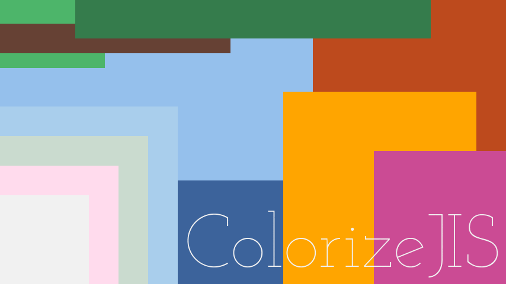
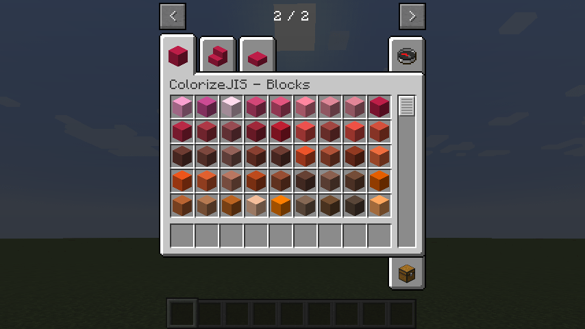
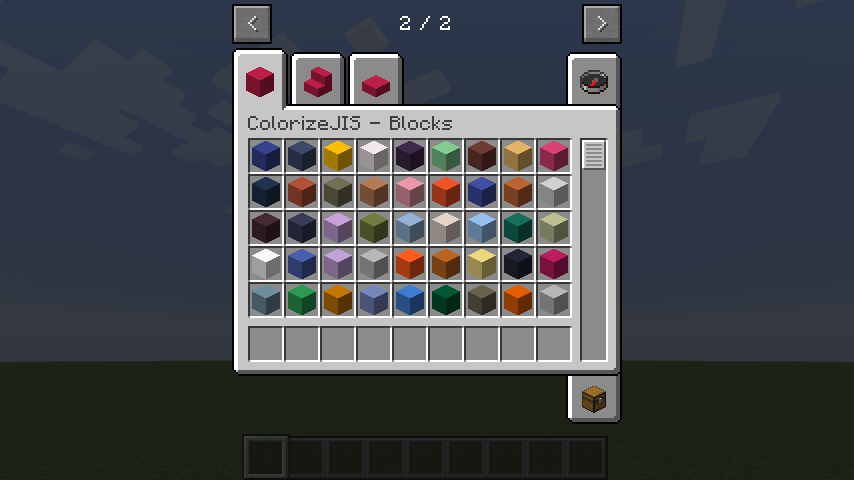
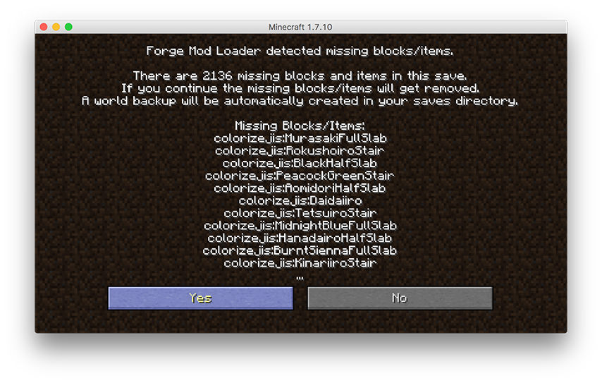
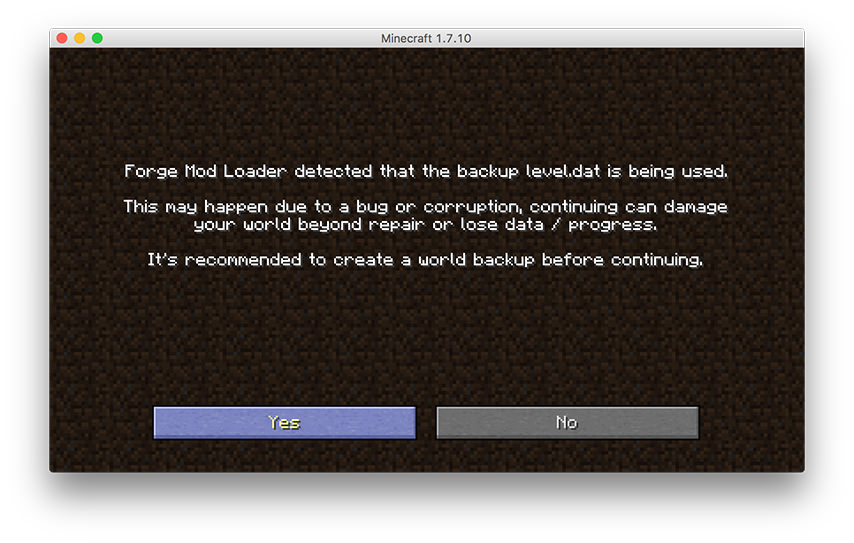

# ColorizeJIS

自由な配色で、自由な建築を！

  

※このModはあくまで個人の製作物であり、JIS(日本工業規格)によるものではありません。

## Minecraft Mod

[Color Blocks 1.4 (GPLv3)](https://github.com/KeeperofMee/Color-Blocks)をベースに派生Modを作成しました。  
[JIS慣用色名 - Wikipedia](https://ja.wikipedia.org/wiki/JIS%E6%85%A3%E7%94%A8%E8%89%B2%E5%90%8D)に記載されている色名・カラーコード(金色・銀色を除いた全267色)を適用したブロックが追加されます。

- 全267色のブロック
- 全267色の階段
- 全267色のハーフブロック

[Minecraft Colorize Blocks Generator](https://github.com/Isthmis/Minecraft-Colorize-Blocks-Generator) (Pythonスクリプトです。CC0ライセンスで公開しています) によってJavaファイルを自動生成しています。  
同じくジェネレーターを使用している[Color Blocks Plus](https://github.com/Isthmis/Color-Blocks-Plus)同様、以下の特徴を備えています。

- マルチプレイ対応
- [MinePainter](http://www.minecraftforum.net/forums/mapping-and-modding/minecraft-mods/1288124-0-2-6-mine-painter-simple-sculpture-and-pixel-art)対応

また、2同様[BuildCraft](http://www.mod-buildcraft.com)の外装板や[Carpenter's Blocks](http://www.carpentersblocks.com)にも使用可能です。  

## Support

- Minecraft 1.7.10
- Forge 10.13.4.1558
- Multiplayer
- No Recipe, **CREATIVE MODE ONLY!** (クリエイティブモード専用)

## Download

<https://github.com/Isthmis/ColorizeJIS/raw/master/resources/package/ColorizeJIS%20-%201.0.jar>

## Usage

### Install
通常のMod同様、`mods/`内に`.jar`ファイルを置くことで動作します。

### Multiplayer
マルチプレイで使用する際は、必ずサーバー側・クライアント側両方に導入してください。  
クライアント側にのみ導入している場合、クリエイティブモードのインベントリ2ページ目以降を表示しようとした際にクラッシュします。(シングルプレイ用プロファイルとマルチプレイ用プロファイルを一緒にしている人はご注意ください。)

### Creative Mode Tab
クリエイティブモードのタブでブロックの表示順が乱れてしまうことがあります。

表示順が乱れている場合のスクリーンショット (BAD CASE)  
  
Forgeの仕様(?)のようなので、おそらくMod側では対策不能です。

インストール→ブロック設置→アンインストール→再度ワールドを開いてMissing BlocksでYes→再度インストール→ワールド修復処理でYes、の手順を行うことで正しくグラデーション状に並ぶ場合があります。(バックアップを取った上で、自己責任で行ってください)

\*\**DO AT YOUR OWN RISK.*\*\*  
  
  

## Development

### Require
- [Minecraft Colorize Blocks Generator](https://github.com/Isthmis/Minecraft-Colorize-Blocks-Generator)
    - Bash
    - Python 3.6.0
    - PyYAML
    - ImageMagick
- Forge
- Gradle

## License

Created by (c) 2017 Mutous

Derived from Color Blocks 1.4 (c) 2014 KeeperofMee  
[KeeperofMee/Color-Blocks](https://github.com/KeeperofMee/Color-Blocks)

This project is licensed under the terms of the GNU General Public License v3.0.

